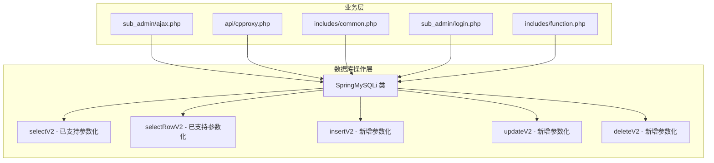

# Design Document

## Overview

本设计文档描述了修复 CCProxy 管理系统中 SQL 注入漏洞的技术方案。核心策略是增强现有的 `SpringMySQLi` 数据库操作类，使其所有方法都支持参数化查询，然后逐步将项目中所有使用字符串拼接的 SQL 查询改为使用参数化查询。

### 设计原则

1. **最小改动原则**: 尽量复用现有的 `selectV2`、`selectRowV2` 方法的实现模式
2. **向后兼容**: 保持原有方法签名，通过新增参数支持参数化查询
3. **渐进式修复**: 按模块逐步修复，确保每次修改后系统仍可正常运行
4. **统一风格**: 所有参数化查询使用相同的占位符风格（`?`）

## Architecture



## Components and Interfaces

### 1. SpringMySQLi 类增强

#### 1.1 新增 insertV2 方法

```php
/**
 * 使用预处理语句插入数据
 * @param string $table 表名
 * @param array $values 键值对数组
 * @return int|false 插入的ID或影响行数，失败返回false
 */
public function insertV2($table, array $values)
```

#### 1.2 新增 updateV2 方法

```php
/**
 * 使用预处理语句更新数据
 * @param string $table 表名
 * @param array $values 要更新的键值对数组
 * @param string $whereClause WHERE子句（使用?占位符）
 * @param array $whereParams WHERE子句的参数
 * @return int|false 影响的行数，失败返回false
 */
public function updateV2($table, array $values, $whereClause, array $whereParams = [])
```

#### 1.3 新增 deleteV2 方法

```php
/**
 * 使用预处理语句删除数据
 * @param string $table 表名
 * @param string $whereClause WHERE子句（使用?占位符）
 * @param array $whereParams WHERE子句的参数
 * @return int|false 影响的行数，失败返回false
 */
public function deleteV2($table, $whereClause, array $whereParams = [])
```

#### 1.4 新增 selectPageV2 方法

```php
/**
 * 使用预处理语句分页查询
 * @param string $sql SQL语句（使用?占位符）
 * @param array $params 参数数组
 * @return array 查询结果
 */
public function selectPageV2($sql, array $params = [])
```

### 2. 业务层修改接口

所有业务层代码将从使用字符串拼接改为使用参数化查询方法。

## Data Models

数据模型保持不变，仅修改数据访问方式。

## Correctness Properties

*A property is a characteristic or behavior that should hold true across all valid executions of a system-essentially, a formal statement about what the system should do. Properties serve as the bridge between human-readable specifications and machine-verifiable correctness guarantees.*

基于 prework 分析，以下是需要验证的正确性属性：

### Property 1: SQL 注入防护 - 插入操作

*For any* 包含 SQL 注入字符（如 `'`, `"`, `--`, `;`）的用户输入，当使用 `insertV2` 方法插入数据时，系统应该安全地将数据作为字面值存储，而不是执行恶意 SQL 代码。

**Validates: Requirements 1.1**

### Property 2: SQL 注入防护 - 更新操作

*For any* 包含 SQL 注入字符的用户输入，当使用 `updateV2` 方法更新数据时，系统应该安全地处理输入，不会导致非预期的数据修改或泄露。

**Validates: Requirements 1.2**

### Property 3: SQL 注入防护 - 删除操作

*For any* 包含 SQL 注入字符的用户输入，当使用 `deleteV2` 方法删除数据时，系统应该只删除符合条件的记录，不会因注入而删除其他记录。

**Validates: Requirements 1.3**

### Property 4: SQL 注入防护 - 查询操作

*For any* 包含 SQL 注入字符的用户输入，当使用参数化查询方法时，系统应该返回正确的查询结果，不会泄露额外数据或执行恶意操作。

**Validates: Requirements 1.4**

### Property 5: 功能等价性 - 数据操作

*For any* 有效的数据操作请求，使用新的参数化方法（V2 方法）应该产生与原方法相同的业务结果（插入、更新、删除的数据一致）。

**Validates: Requirements 8.1, 8.2**

### Property 6: 错误处理一致性

*For any* 无效输入或错误条件，修复后的系统应该返回与修复前相同格式的错误响应。

**Validates: Requirements 8.3**

## Error Handling

### 数据库操作错误

1. **连接失败**: 返回 `false` 并设置 `errNo` 和 `errMsg`
2. **预处理失败**: 返回 `false` 并记录错误信息
3. **参数绑定失败**: 返回 `false` 并记录错误信息
4. **执行失败**: 返回 `false` 并设置错误状态

### 业务层错误处理

保持现有的错误处理逻辑不变：
- 返回 JSON 格式的错误响应
- 包含 `code`、`msg`、`icon` 字段
- 记录错误日志

## Testing Strategy

### 单元测试

1. **数据库操作类测试**
   - 测试 `insertV2` 方法的基本功能
   - 测试 `updateV2` 方法的基本功能
   - 测试 `deleteV2` 方法的基本功能
   - 测试 `selectPageV2` 方法的基本功能

2. **SQL 注入防护测试**
   - 测试各种 SQL 注入 payload
   - 验证恶意输入被安全处理

### 属性测试

使用 PHP 的属性测试库（如 Eris 或 QuickCheck for PHP）进行属性测试：

1. **Property 1-4**: 生成包含各种 SQL 注入字符的随机字符串，验证系统安全处理
2. **Property 5**: 生成随机有效数据，验证新旧方法结果一致
3. **Property 6**: 生成各种错误条件，验证错误响应格式一致

### 集成测试

1. **API 接口测试**
   - 测试所有 API 端点的正常功能
   - 测试 API 端点对恶意输入的处理

2. **回归测试**
   - 验证所有现有功能正常工作
   - 验证 API 响应格式不变

### 测试框架

- 使用 PHPUnit 进行单元测试和集成测试
- 使用 Eris（PHPUnit 的属性测试扩展）进行属性测试
- 每个属性测试运行至少 100 次迭代

