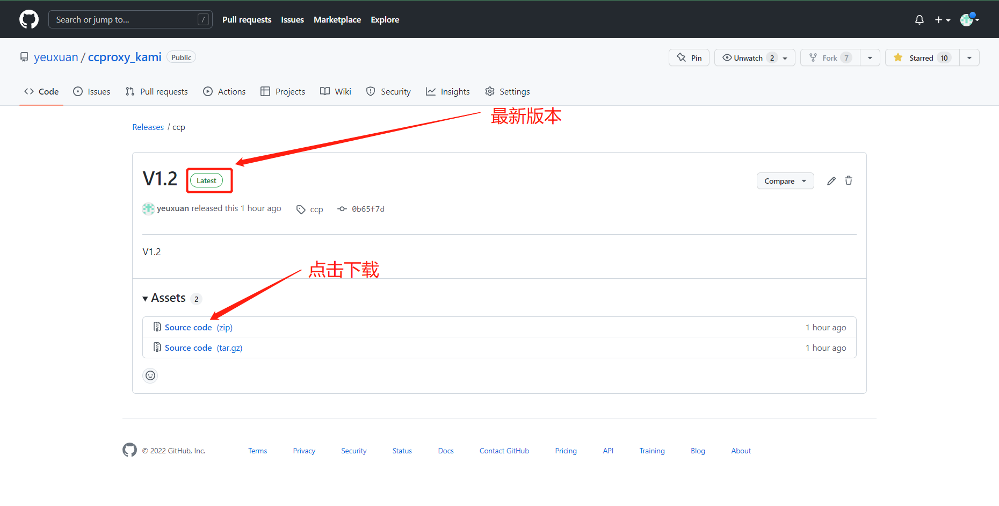
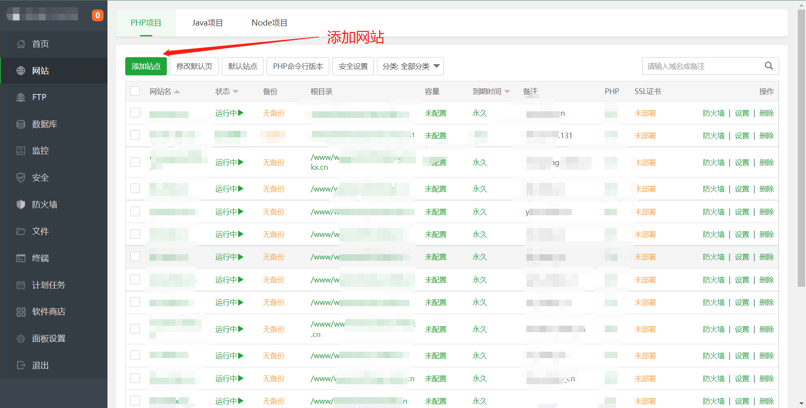
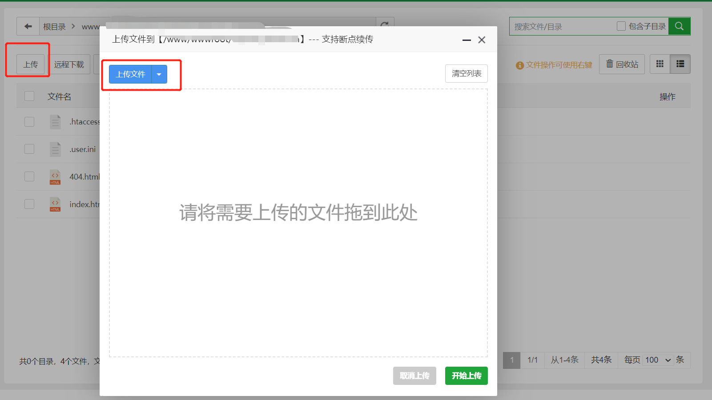

# 一花CCPROXY 安装教程

## 一、上传到服务器

教程用的是bt.cn面板，所以这里就不讲bt的安装了，需要的去bt.cn自己查看教程，

首先下载源码一定要下载最新版本的！

然后打开我们的bt面板，看图操作：

1.

2.

3.点提交后

4.

5.上传并解压文件到网站根目录

6.接下来 域名/install 进入安装程序，直接访问网站也会有提示

**注意如果这里失败了请检查你的数据库账号密码，数据库执行失败是你已经安装过了，所以删除原来的数据库就可以了。**

7.到这里就结束了，点击确定会跳转到成功页面，有提示的默认账号密码和后台地址，接下来你就可以使用啦！
